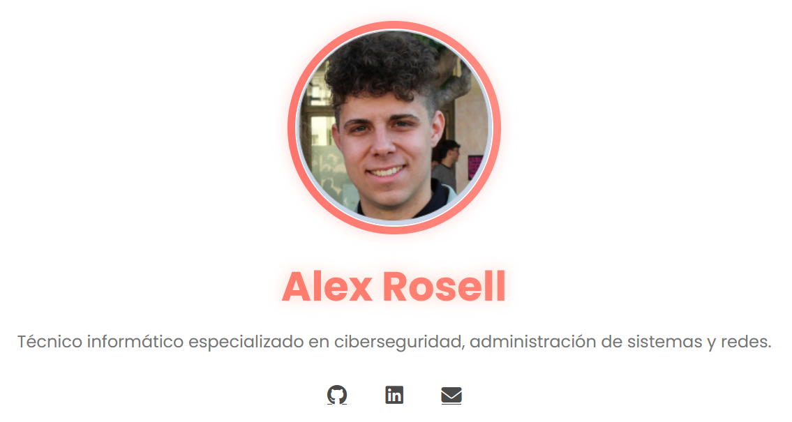

<p align="center">
  
</p>

# 💻 Portfolio Personal — Alex Rosell

> Técnico informático especializado en **ciberseguridad**, **administración de sistemas** y **redes**.  
> Este repositorio contiene el código fuente de mi portfolio web personal, desarrollado con HTML, CSS y JavaScript.

---

### 🌐 Visita mi portfolio online
👉 **[https://zane2300.github.io/portfolio-alex/](https://zane2300.github.io/portfolio-alex/)**

En la web encontrarás información sobre:
- Mi formación académica y experiencia profesional  
- Habilidades técnicas en ciberseguridad, redes y desarrollo  
- Proyectos destacados y enlaces de contacto  

---

### 🧰 Tecnologías utilizadas
- HTML5  
- CSS3 (Variables personalizadas y modo oscuro)  
- JavaScript  

---

### 📂 Estructura del repositorio
```
portfolio-alex/
├───assets
│    └──images
│       ├── profile.jpg
│       └── web_banner.png
├── .gitignore
├── certifications.css
├── certifications.html
├── index.html
├── script.js
├── styles.css
└── README.md
```

---

### 📫 Contacto
Puedes ponerte en contacto conmigo a través de:
- **LinkedIn:** [linkedin.com/in/alex-rosell-angullo](https://www.linkedin.com/in/alex-rosell-angullo/)
- **GitHub:** [github.com/Zane2300](https://github.com/Zane2300)
- **Email:** alexrosell2003@gmail.com

---

<p align="center">
  © 2025 — Alex Rosell · Portfolio Personal
</p>
